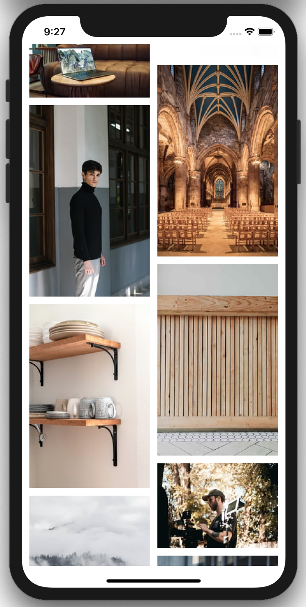

## The goal of this app 
Building everything without third party libraries. What I have done so far:
- Integrate microservices into the networking layer. 
- Write an ImageDownloader combining with an ImageCache.
- Customize CollectionViewLayout to handle cell sizing based on photo height. 
- Load more photos. 

